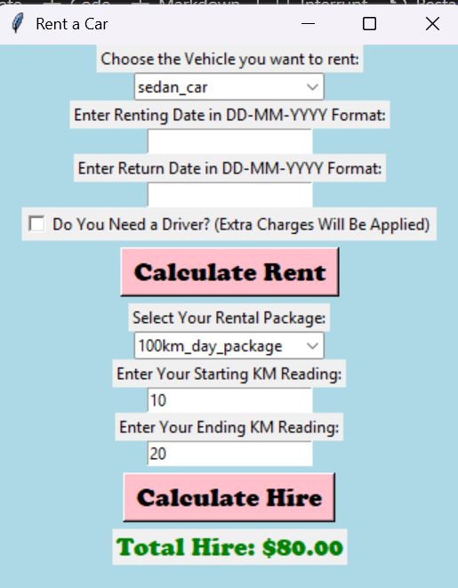
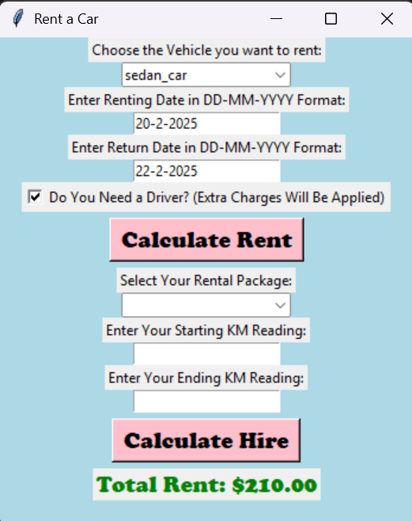

# Rent a Car 🚗  
A simple **Python Tkinter GUI** project for managing car rentals and hire packages. The app allows users to calculate rental charges based on vehicle type, rental duration, driver options, and day-hire packages with KM/time limits.  

---

## ✨ Features  
- Vehicle selection (small car, sedan, SUV).  
- Daily, weekly, and monthly rental calculations.  
- Option to add a driver with extra charges.  
- Hire packages (Airport drop, 100km day package).  
- Validation for dates and kilometer readings.  
- Clear GUI interface with Tkinter.  

---

## 🖥️ Tech Stack  
- **Python 3**  
- **Tkinter** (GUI framework)  

---

## 📸 Screenshots

| Hire Calculation | Rent Calculation |
|------------------|------------------|
|  |  |

---

## 🚀 How to Run

Clone the repository:

git clone https://github.com/your-username/rent-a-car.git
cd rent-a-car

Run the script locally.

---

## 📌 Future Improvements

- Add night charges and extended features.
- Store rental history in a file or database.
- Improve UI design with better layouts.

---

## 📄 License

This project is open-source. You may use and modify it freely.
